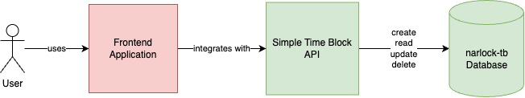
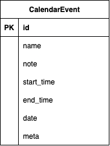
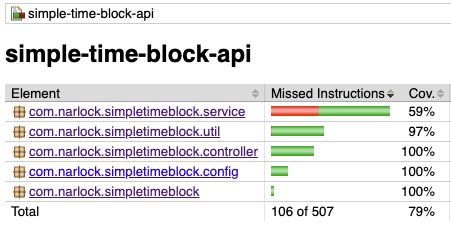

# Simple Time Block API


**Simple Time Block API** is a simple calendar event management microservice: create, read, update, and delete time-blocked 
calendar events. This project's purpose is to be a simple integration for people interested in a simple time blocking 
solution. The base application is programmed in [Java](https://www.java.com/), using the [Spring Boot](https://spring.io/projects/spring-boot) framework. The application utilizes
[Spring Data JPA](https://spring.io/projects/spring-data-jpa) to perform operations against a [MySQL](https://www.mysql.com/) database. Unit testing for this API is in [Groovy](https://groovy-lang.org/), using the
[Spock](https://spockframework.org/) framework.

## Requirements to Run

This section assumes that the user of this software has the knowledge of installing Java 17 and running maven-based
Java applications. It also assumes that the user knows how to install and configure a MySQL database server.
- **MySQL**: With MySQL running, configure and run the `setup_database.sql` script to create the **narlock-tb** database.
- **Run the application**
  - Using **Java 17**: After building the application, navigate to the directory of the jar in a terminal and 
  use `java -jar simple-time-block-api.jar` to run the application.
  - Using **Maven**: In a terminal, use `mvn spring-boot:run` to run the application.

## Application Design

This application creates both the integration layer (Simple Time Block API) as well as the backend database 
(narlock-tb Database).



The following is the database table represents an individual calendar event. When a calendar event is created,
a unique id number will be assigned to it. There can be many calendar events that have the same start time and
end time that are on the same day.



## API Specification

**Guide**
- [**Create** a time-blocked event](#create-a-time-blocked-event)
- [**Create** a *recurring* time-blocked event](#create-a-recurring-time-blocked-event)
- [**Overwrite** an existing time-blocked event](#overwrite-an-existing-time-blocked-event)
- [**Update** fields on an existing time-blocked event](#update-fields-on-an-existing-time-blocked-event)
- [**Delete** an existing time-blocked event](#delete-a-time-blocked-event)
- [**Delete** time-blocked events on a given day](#delete-all-events-on-a-given-day)
- [**Retrieve** time-blocked events on a given day](#retrieve-all-events-on-a-given-day)
- [**Retrieve** a time-blocked event](#retrieve-a-time-blocked-event)

### Create a time-blocked event
The user can input the name of their event, a note, and the start time and end time of the event in the request payload.
This will create the event and store it on the backend database. **Name**, **start time**, and **end time** are the only
required fields for creating a time-blocked event. If the **date** parameter is not passed to the endpoint, the event will
be created on the current local date.

```json
POST /time-block
Content-Type: application/json

{
   "name": "Yearly Eye Exam",
   "note": "123 John Doe Drive, Gotham City",
   "startTime": "16:00:00",
   "endTime": "16:30:00",
   "date": "2024-02-21",
   "meta": ""
}
```

**Response**
```json
HTTP/1.1 201 Created

{
   "id": 1,
   "name": "Yearly Eye Exam",
   "note": "123 John Doe Drive, Gotham City",
   "startTime": "16:00:00",
   "endTime": "16:30:00",
   "date": "2024-02-21",
   "meta": ""
}
```

### Create a recurring time-blocked event
Users can create a recurring time-blocked event based on a set of criteria.
- **Repeat**: When will this event reoccur?
  - `DAILY`, `WEEKLY`, or `MONTHLY`
- **Until**: How long events will be created after the start date.
  - `WEEK`, create events only up to the next seven days
  - `MONTH`, create events only up to the next 31 days
  - `#MONTH`, create events only up to the next # * 31 days, where `#` is a number `1-11` that represent the following `#` months.
  - `YEAR`, create events only up to the next 365 days

```json
POST /time-block
Content-Type: application/json

{
   "repeat": "DAILY",
   "until": "YEAR",
   "event": {
      "name": "Yearly Eye Exam",
      "note": "123 John Doe Drive, Gotham City",
      "startTime": "16:00:00",
      "endTime": "16:30:00",
      "date": "2024-02-21",
      "meta": ""
   }
}
```

**Response**
```json
HTTP/1.1 201 Created

{
   "count": 365,
   "startDate": "2024-02-21",
   "endDate": "2025-02-21"
}
```

### Overwrite an existing time-blocked event
The user can perform a full update on a time-blocked event. This means that every field is required to pass to
overwrite.

```json
PUT /time-block/{id}
Content-Type: application/json

{
   "name": "Yearly Eye Exam",
   "note": "123 John Doe Drive, Gotham City",
   "startTime": "16:00:00",
   "endTime": "16:30:00",
   "date": "2024-02-21",
   "meta": ""
}
```

**Response**
```json
HTTP/1.1 200 OK

{
   "id": 1,
   "name": "Yearly Eye Exam",
   "note": "123 John Doe Drive, Gotham City",
   "startTime": "16:00:00",
   "endTime": "16:30:00",
   "date": "2024-02-21",
   "meta": ""
}
```

### Update fields on an existing time-blocked event
The user can overwrite specific fields of an existing time-blocked event. The parameters that are passed within
the request payload will be updated for the given event id.

```json
PATCH /time-block/{id}
Content-Type: application/json

{
   "name": "Yearly Eye Exam",
   "note": "123 John Doe Drive, Gotham City",
   "startTime": "16:00:00",
   "endTime": "16:30:00",
   "date": "2024-02-21",
   "meta": ""
}
```

**Response**
```json
HTTP/1.1 200 OK

{
   "id": 1,
   "name": "Yearly Eye Exam",
   "note": "123 John Doe Drive, Gotham City",
   "startTime": "16:00:00",
   "endTime": "16:30:00",
   "date": "2024-02-21",
   "meta": ""
}
```

### Delete a time-blocked event
The user can delete an existing time-blocked event.

```json
DELETE /time-block/{id}
```

**Response**
```json
HTTP/1.1 204 No Content
```

### Delete all events on a given day
The user can delete all time-blocked events on a given day.

```json
DELETE /time-block?day=yyyy-MM-dd
```

**Response**
```json
HTTP/1.1 204 No Content
```

### Retrieve all events on a given day
The user can retrieve all time-blocked events on a given day.

```json
GET /time-block?day=yyyy-MM-dd
Content-Type: application/json
```

**Response**
```json
HTTP/1.1 200 OK

{
   "date": "2024-02-21",
   "count": 2,
   "events": [
      {
         "id": 1,
         "name": "Yearly Eye Exam",
         "note": "123 John Doe Drive, Gotham City",
         "startTime": "16:00:00",
         "endTime": "16:30:00",
         "date": "2024-02-21",
         "meta": ""
      },
      {
         "id": 2,
         "name": "Study for English exam",
         "note": "",
         "startTime": "18:00:00",
         "endTime": "20:00:00",
         "date": "2024-02-21",
         "meta": ""
      },
   ]
}
```

### Retrieve a time-blocked event
The user can obtain a specific time-blocked event.

```json
GET /time-block/{id}
Content-Type: application/json
```

**Response**
```json
HTTP/1.1 200 OK

{
   "id": 1,
   "name": "Yearly Eye Exam",
   "note": "123 John Doe Drive, Gotham City",
   "startTime": "16:00:00",
   "endTime": "16:30:00",
   "date": "2024-02-21",
   "meta": ""
}
```

## Test Coverage


